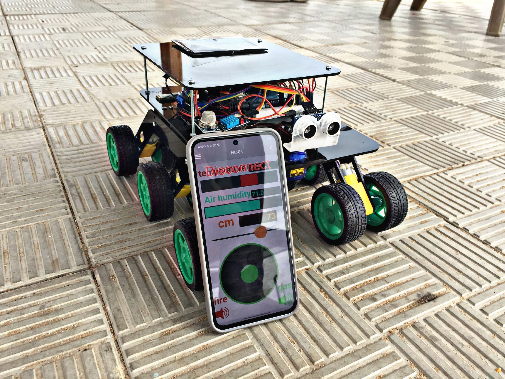

# RoverVehicle - Smart Rover Vehicle

This is a Smart Rover Vehicle inspired by GalaxyRVR. The project includes:

- 🔧 Arduino
- 📱 RemoteXY mobile app interface
- 🛠️ Custom motor control for 6-wheel drive
- 📷 Camera streaming with control
- 🚗 servo, and sensor integration

## 📁 Project Structure

- `firmware/`: Arduino Code.
- `mobile-app/`: RemoteXY mobile interface.
- `hardware/`: Wiring diagrams and circuit design.
- `media/`: Videos and Project Images.

## 🔌 Hardware Used

- Arduino
- 6 Motors + Driver
- Servo
- Camera module
- Power bank

## 📱 How to Use

1. Flash `app.ino` to your Arduino.
2. Open the RemoteXY app and load the interface.
3. Power on the rover and connect.

## 📸 Demo

[Watch the demo video](media/robot-main.mp4)
